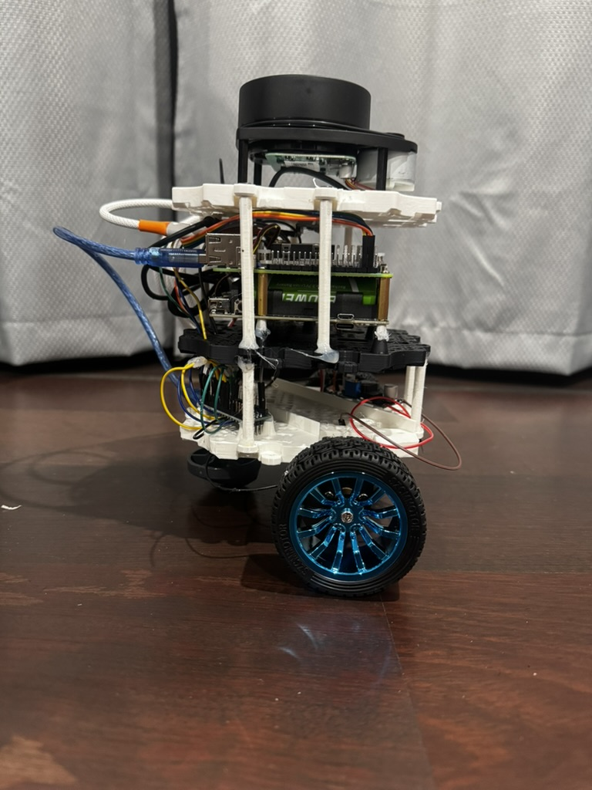
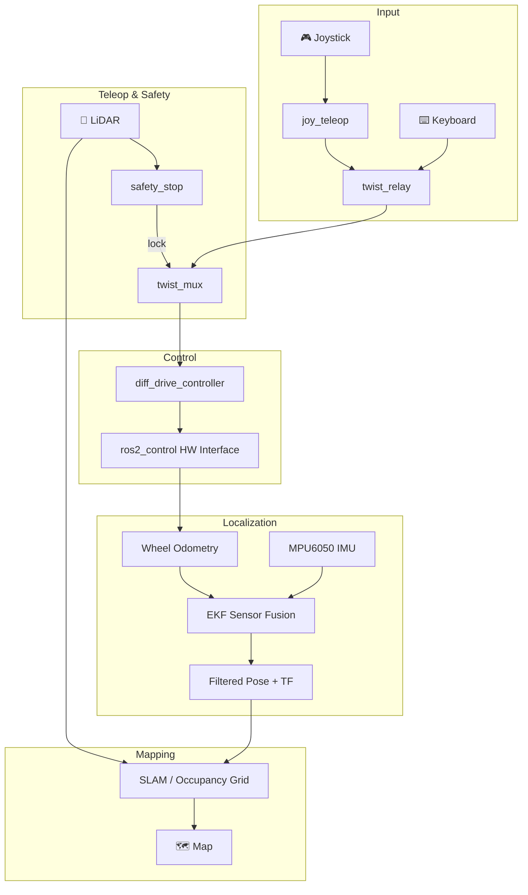

<p align="center">
  <h1 align="center">🤖 Bumperbot — ROS 2 Differential Drive Robot</h1>
  <p align="center">
    A fully autonomous differential-drive mobile robot built with <strong>ROS 2</strong>, featuring real-time teleoperation, EKF-based sensor fusion, SLAM, occupancy grid mapping, and safety-aware obstacle avoidance.
  </p>
</p>

<p align="center">
  
  
  
  
  
</p>

---

## 📸 The Robot

<!-- ============================================================
     PLACEHOLDER: Replace the path below with an actual photo of
     your physical Bumperbot robot. Recommended size: 800×600px.
     Example: 
     ============================================================ -->

| | |
|:---:|:---:|
|  |
| *Side View* |

> **⬆️ TODO:** Replace the placeholder paths above with actual photos of your Bumperbot. Add your images to a `docs/images/` directory.

---

## 🎬 Demo Video
<video width="2160" height="3840" alt="7A13EDF0-692F-4E86-B306-2B0643A5267B_1_206_a" src="https://github.com/user-attachments/assets/aef9bed7-548a-4e78-82c1-d889f800ac4a" />


<!-- ============================================================
     PLACEHOLDER: Replace the link below with a YouTube/GIF of
     your Bumperbot navigating, mapping, or being teleoperated.
     
     Option A — Embedded GIF:
       
     
     Option B — YouTube link:
       [](https://youtu.be/YOUR_VIDEO_ID)
     ============================================================ -->

---

## 🏗️ Architecture Overview



The system is organized into modular ROS 2 packages that handle everything from low-level motor control to high-level mapping and localization. See the full [architecture documentation](bumperbot_architecture.md) for detailed node/topic descriptions.

---

## 📦 Package Structure

| Package | Description |
|---------|-------------|
| `bumperbot_description` | URDF/Xacro robot model, meshes, Gazebo worlds, and RViz configs |
| `bumperbot_controller` | Differential drive controller, joystick teleop, twist relay nodes |
| `bumperbot_bringup` | Top-level launch files for simulation and real robot |
| `bumperbot_firmware` | Hardware interface for `ros2_control`, MPU6050 IMU driver, Arduino firmware |
| `bumperbot_localization` | EKF sensor fusion, Kalman filter, odometry motion model, IMU republisher |
| `bumperbot_mapping` | Occupancy grid mapping with Bresenham ray-casting, SLAM integration |
| `bumperbot_utils` | Safety stop node with LiDAR-based collision avoidance |
| `bumperbot_msgs` | Custom message and service definitions |
| `bumperbot_cpp_examples` | C++ example nodes |
| `bumperbot_py_examples` | Python example nodes |
| `bumperbot_firmware_tutorial` | Firmware tutorial and reference code |
| `sllidar_ros2` | SLAMTEC RPLiDAR ROS 2 driver |

---

## ✅ Prerequisites

- **OS:** Ubuntu 22.04+ (or any OS supporting ROS 2)
- **ROS 2:** Humble Hawksbill or Iron Irwini
- **Gazebo:** Gazebo Fortress / Harmonic (for simulation)
- **Build System:** `colcon`

### Required ROS 2 Packages

```bash
sudo apt update && sudo apt install -y \
  ros-${ROS_DISTRO}-xacro \
  ros-${ROS_DISTRO}-robot-state-publisher \
  ros-${ROS_DISTRO}-joint-state-publisher-gui \
  ros-${ROS_DISTRO}-ros2-control \
  ros-${ROS_DISTRO}-ros2-controllers \
  ros-${ROS_DISTRO}-gz-ros2-control \
  ros-${ROS_DISTRO}-ros-gz \
  ros-${ROS_DISTRO}-twist-mux \
  ros-${ROS_DISTRO}-joy \
  ros-${ROS_DISTRO}-joy-teleop \
  ros-${ROS_DISTRO}-robot-localization \
  ros-${ROS_DISTRO}-nav2-map-server \
  ros-${ROS_DISTRO}-slam-toolbox \
  ros-${ROS_DISTRO}-navigation2
```

---

## 🚀 Getting Started

### 1. Clone the Repository

```bash
git clone https://github.com/sathyalhr143/bumperbot_ws.git
cd bumperbot_ws
```

### 2. Install Dependencies

```bash
# Source your ROS 2 installation
source /opt/ros/${ROS_DISTRO}/setup.bash

# Install any missing rosdep dependencies
sudo rosdep init   # only needed once
rosdep update
rosdep install --from-paths src --ignore-src -r -y
```

### 3. Build the Workspace

```bash
colcon build --symlink-install
```

### 4. Source the Workspace

```bash
source install/setup.bash
```

> **💡 Tip:** Add the source command to your `~/.bashrc` so you don't have to run it every time:
> ```bash
> echo "source ~/bumperbot_ws/install/setup.bash" >> ~/.bashrc
> ```

---

## 🎮 Usage

### Launch the Simulated Robot (Gazebo)

```bash
ros2 launch bumperbot_bringup simulated_robot.launch.py
```

This will start:
- Gazebo simulation with the Bumperbot model
- Differential drive controller
- Joystick teleoperation
- Safety stop node
- Localization (EKF + AMCL)
- RViz visualization

#### With SLAM Enabled

```bash
ros2 launch bumperbot_bringup simulated_robot.launch.py use_slam:=true
```

### Launch the Real Robot

```bash
ros2 launch bumperbot_bringup real_robot.launch.py
```

> **⚠️ Note:** Ensure your hardware (motors, IMU, LiDAR) is properly connected and configured before launching the real robot.

### View the Robot Model in RViz

```bash
ros2 launch bumperbot_description display.launch.py
```

### Launch Gazebo World Only

```bash
ros2 launch bumperbot_description gazebo.launch.py
```

---

## 🔧 Key Features

<table>
  <tr>
    <td width="50%">
      <h3>🕹️ Multi-Input Teleoperation</h3>
      <p>Control the robot via joystick or keyboard with priority-based command multiplexing through <code>twist_mux</code>.</p>
    </td>
    <td width="50%">
      <h3>🛡️ Safety-Aware Navigation</h3>
      <p>LiDAR-based obstacle detection with dynamic warning and danger zones that automatically stop the robot.</p>
    </td>
  </tr>
  <tr>
    <td width="50%">
      <h3>📍 EKF Sensor Fusion</h3>
      <p>Extended Kalman Filter fusing wheel odometry and IMU data for accurate pose estimation via <code>robot_localization</code>.</p>
    </td>
    <td width="50%">
      <h3>🗺️ SLAM & Mapping</h3>
      <p>Real-time occupancy grid mapping using log-odds probability with Bresenham ray-casting, plus <code>slam_toolbox</code> integration.</p>
    </td>
  </tr>
  <tr>
    <td width="50%">
      <h3>⚙️ ros2_control Integration</h3>
      <p>Hardware abstraction via <code>ros2_control</code> enabling seamless switching between simulation and real hardware.</p>
    </td>
    <td width="50%">
      <h3>🧪 Educational Components</h3>
      <p>Custom Kalman filter, odometry motion model with particle visualization, and noisy controller for learning probabilistic robotics.</p>
    </td>
  </tr>
</table>

---

## 🗂️ Workspace Layout

```
bumperbot_ws/
├── src/
│   ├── bumperbot_bringup/         # Top-level launch files
│   │   └── launch/
│   │       ├── simulated_robot.launch.py
│   │       └── real_robot.launch.py
│   ├── bumperbot_description/     # Robot model & simulation
│   │   ├── urdf/                  # URDF/Xacro files
│   │   ├── meshes/                # 3D mesh files
│   │   ├── worlds/                # Gazebo world files
│   │   └── launch/
│   ├── bumperbot_controller/      # Control & teleop
│   ├── bumperbot_firmware/        # Hardware interface & drivers
│   ├── bumperbot_localization/    # EKF, Kalman filter, motion models
│   ├── bumperbot_mapping/         # Occupancy grid & SLAM
│   ├── bumperbot_utils/           # Safety stop & utilities
│   ├── bumperbot_msgs/            # Custom messages
│   └── sllidar_ros2/              # RPLiDAR driver
├── bumperbot_architecture.md      # Detailed architecture docs
└── README.md
```

---

## 🤝 Contributing

Contributions are welcome! If you'd like to improve this project:

1. Fork the repository
2. Create a feature branch (`git checkout -b feature/amazing-feature`)
3. Commit your changes (`git commit -m 'Add amazing feature'`)
4. Push to the branch (`git push origin feature/amazing-feature`)
5. Open a Pull Request

---

## 📄 License

This project is licensed under the **Apache 2.0 License** — see the [LICENSE](LICENSE) file for details.

---

## 🙏 Acknowledgments

- [ROS 2 Documentation](https://docs.ros.org/en/humble/)
- [Gazebo Simulation](https://gazebosim.org/)
- [Navigation 2 (Nav2)](https://docs.nav2.org/)
- [robot_localization](https://docs.ros.org/en/humble/p/robot_localization/)
- [slam_toolbox](https://github.com/SteveMacenski/slam_toolbox)

---

<p align="center">
  <sub>Built with ❤️ and ROS 2</sub>
</p>
