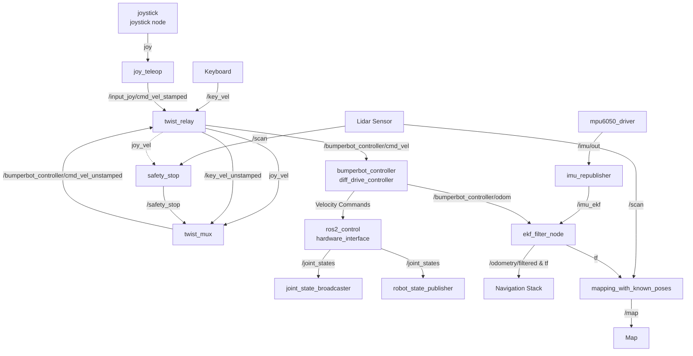

# Bumperbot Architecture

This document provides a detailed overview of the Bumperbot project's ROS 2 architecture, including nodes, topics, actions, and services across various subsystems.

## 1. High-Level Architecture Graph

Below is the high-level data flow diagram showing the core nodes and topics.

---

## 2. Teleoperation and Control Stack

This subsystem processes user inputs from a joystick or keyboard, applies safety constraints, and passes commands down to the motor controllers.

### `joy_node` (package: joy)
- **Description**: Reads inputs from the physical game controller.
- **Published Topics**: 
  - `/joy` (`sensor_msgs/Joy`): Raw axes and buttons data.

### `joy_teleop` (package: joy_teleop)
- **Description**: Maps raw joystick buttons/axes to velocity commands (requires deadman button 5 to be held).
- **Subscribed Topics**: `/joy` (`sensor_msgs/Joy`)
- **Published Topics**:
  - `/input_joy/cmd_vel_stamped` (`geometry_msgs/TwistStamped`)

### `twist_relay` (package: bumperbot_controller)
- **Description**: A utility node that relays and converts `TwistStamped` messages to `Twist` messages (and vice versa) so that they are compatible with `twist_mux`.
- **Subscribed Topics**: 
  - `/input_joy/cmd_vel_stamped` (`geometry_msgs/TwistStamped`)
  - `/key_vel` (`geometry_msgs/TwistStamped`)
  - `/bumperbot_controller/cmd_vel_unstamped` (`geometry_msgs/Twist`)
- **Published Topics**:
  - `joy_vel` (`geometry_msgs/Twist`): Sent to `twist_mux`.
  - `/key_vel_unstamped` (`geometry_msgs/Twist`): Sent to `twist_mux`.
  - `/bumperbot_controller/cmd_vel` (`geometry_msgs/TwistStamped`): Sent to the actual robot controller.

### `twist_mux` (package: twist_mux)
- **Description**: Multiplexes different velocity commands based on priority (joystick has priority 99, keyboard has priority 90). It also listens to locks to completely stop the robot if a safety condition is triggered.
- **Subscribed Topics**:
  - `joy_vel` (`geometry_msgs/Twist`)
  - `/key_vel_unstamped` (`geometry_msgs/Twist`)
  - `/safety_stop` (`std_msgs/Bool`): Priority 255 lock.
- **Published Topics**:
  - `/bumperbot_controller/cmd_vel_unstamped` (`geometry_msgs/Twist`)

### `safety_stop` (package: bumperbot_utils)
- **Description**: Analyzes laser scan data and joystick velocity to determine if the robot is about to collide with an obstacle. Creates warning zones and danger zones.
- **Subscribed Topics**:
  - `/scan` (`sensor_msgs/LaserScan`)
  - `joy_vel` (`geometry_msgs/Twist`)
- **Published Topics**:
  - `/safety_stop` (`std_msgs/Bool`): Activates the lock in `twist_mux` if in danger zone.
  - `/satefy_zones` (`visualization_msgs/MarkerArray`): Displays the hazard zones in RViz.
- **Action Clients**:
  - `joy_turbo_decrease` / `joy_turbo_increase` (`twist_mux_msgs/JoyTurbo`): Adjusts speed limits dynamically.

### `ros2_control_node` / `bumperbot_controller` (package: controller_manager)
- **Description**: The core hardware interface and differential drive controller manager. Uses the `diff_drive_controller` plugin.
- **Subscribed Topics**: 
  - `/bumperbot_controller/cmd_vel` (`geometry_msgs/TwistStamped`)
- **Published Topics**:
  - `/bumperbot_controller/odom` (`nav_msgs/Odometry`): Wheel odometry.
  - `/joint_states` (`sensor_msgs/JointState`): Wheel joint positions.
  - `/tf` (`tf2_msgs/TFMessage`): Transform from `odom` -> `base_footprint`.

---

## 3. Sensors and Hardware Interface

### `mpu6050_driver` (package: bumperbot_firmware)
- **Description**: Custom Python driver to read raw accelerometer and gyroscope data from the MPU6050 over I2C.
- **Published Topics**:
  - `/imu/out` (`sensor_msgs/Imu`): Raw IMU data.

### `robot_state_publisher` (package: robot_state_publisher)
- **Description**: Broadcasts the static transformations of the robot using its URDF.
- **Subscribed Topics**: `/joint_states` (`sensor_msgs/JointState`)
- **Published Topics**: `/tf`, `/tf_static`, `/robot_description`

---

## 4. Localization and Mapping

### `imu_republisher` (package: bumperbot_localization)
- **Description**: Re-publishes IMU data with a modified `frame_id` (`base_footprint_ekf`) specifically formatted for the EKF node.
- **Subscribed Topics**: `/imu/out` (`sensor_msgs/Imu`)
- **Published Topics**: `/imu_ekf` (`sensor_msgs/Imu`)

### `ekf_filter_node` (package: robot_localization)
- **Description**: Extended Kalman Filter that fuses wheel odometry and IMU data to produce a highly accurate pose estimation.
- **Subscribed Topics**:
  - `/bumperbot_controller/odom` (`nav_msgs/Odometry`)
  - `/imu_ekf` (`sensor_msgs/Imu`)
- **Published Topics**:
  - `/odometry/filtered` (`nav_msgs/Odometry`)
  - `/tf`: Smoothed transform from `odom` to `base_footprint`.

### `mapping_with_known_poses` (package: bumperbot_mapping)
- **Description**: Uses accurate known poses (from `odom` or `tf`) and laser scans to project obstacles onto an occupancy grid map.
- **Subscribed Topics**: `/scan` (`sensor_msgs/LaserScan`)
- **Published Topics**: `/map` (`nav_msgs/OccupancyGrid`)

### `nav2_map_server` (package: nav2_map_server)
- **Description**: ROS 2 Nav2 map server for loading pre-existing map files. Managed by the `lifecycle_manager`.
- **Services**:
  - `/map_server/load_map` (`nav2_msgs/LoadMap`)
- **Published Topics**: `/map` (`nav_msgs/OccupancyGrid`)

---

## 5. Examples & Tests

### `simple_controller` & `noisy_controller` (package: bumperbot_controller)
- **Description**: Custom Python/C++ implementations of a differential drive kinematic model used for educational purposes and testing. They can be toggled using launch arguments.
