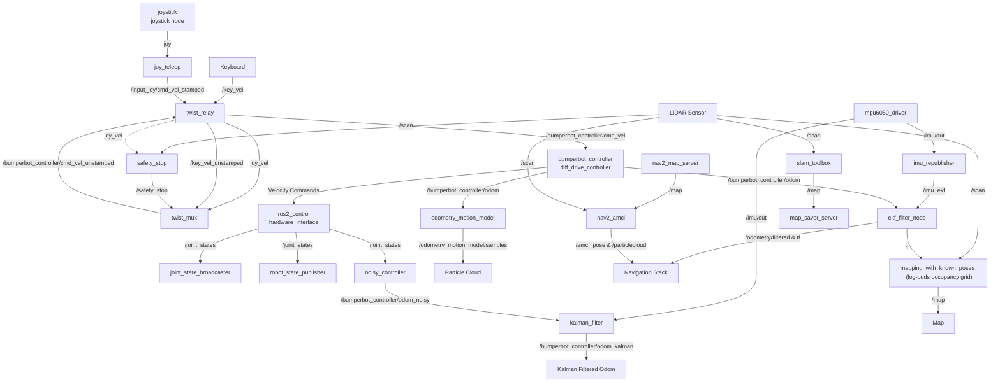

# Bumperbot Architecture

This document provides a detailed overview of the Bumperbot project's ROS 2 architecture, including all nodes, topics, actions, services, launch files, and configuration across every subsystem.

---

## 1. High-Level Architecture Graph

Below is the high-level data flow diagram showing the core nodes and topics.


```mermaid
graph TD
    %% Input Devices
    Joy[joystick <br/> joystick node] -->|joy| JoyTeleop[joy_teleop]
    Keyboard[Keyboard] -->|/key_vel| TwistRelay[twist_relay]

    %% Teleoperation Flow
    JoyTeleop -->|/input_joy/cmd_vel_stamped| TwistRelay
    TwistRelay -->|joy_vel| TwistMux[twist_mux]
    TwistRelay -->|/key_vel_unstamped| TwistMux
    
    %% Safety & Multiplexing
    Lidar[LiDAR Sensor] -->|/scan| SafetyStop[safety_stop]
    TwistRelay -.->|joy_vel| SafetyStop
    SafetyStop -->|/safety_stop| TwistMux
    
    %% Control Flow
    TwistMux -->|/bumperbot_controller/cmd_vel_unstamped| TwistRelay
    TwistRelay -->|/bumperbot_controller/cmd_vel| BumperbotCtrl[bumperbot_controller <br/> diff_drive_controller]
    
    %% Hardware Interface
    BumperbotCtrl -->|Velocity Commands| Hardware[ros2_control <br/> hardware_interface]
    Hardware -->|/joint_states| JointStateBroadcaster[joint_state_broadcaster]
    Hardware -->|/joint_states| RSP[robot_state_publisher]
    Hardware -->|/joint_states| NoisyCtrl[noisy_controller]
    
    %% Sensors & Localization
    MPU[mpu6050_driver] -->|/imu/out| IMURepub[imu_republisher]
    MPU -->|/imu/out| KF[kalman_filter]
    IMURepub -->|/imu_ekf| EKF[ekf_filter_node]
    BumperbotCtrl -->|/bumperbot_controller/odom| EKF
    BumperbotCtrl -->|/bumperbot_controller/odom| OdoMM[odometry_motion_model]
    NoisyCtrl -->|/bumperbot_controller/odom_noisy| KF
    KF -->|/bumperbot_controller/odom_kalman| KFOut[Kalman Filtered Odom]
    OdoMM -->|/odometry_motion_model/samples| Particles[Particle Cloud]
    EKF -->|/odometry/filtered & tf| Nav[Navigation Stack]
    
    %% AMCL (Global Localization)
    Nav2MapServer[nav2_map_server] -->|/map| AMCL[nav2_amcl]
    Lidar -->|/scan| AMCL
    AMCL -->|/amcl_pose & /particlecloud| Nav

    %% Mapping
    Lidar -->|/scan| Mapper["mapping_with_known_poses <br/> (log-odds occupancy grid)"]
    EKF -->|tf| Mapper
    Mapper -->|/map| MapOutput[Map]

    %% SLAM
    Lidar -->|/scan| SLAMToolbox[slam_toolbox]
    SLAMToolbox -->|/map| MapSaver[map_saver_server]
```

---

## 2. Teleoperation and Control Stack

This subsystem processes user inputs from a joystick or keyboard, applies safety constraints, and passes commands down to the motor controllers.

### `joy_node` (package: `joy`)
- **Description**: Reads inputs from the physical game controller.
- **Published Topics**: 
  - `/joy` (`sensor_msgs/Joy`): Raw axes and buttons data.

### `joy_teleop` (package: `joy_teleop`)
- **Description**: Maps raw joystick buttons/axes to velocity commands (requires deadman button 5 to be held).
- **Subscribed Topics**: `/joy` (`sensor_msgs/Joy`)
- **Published Topics**:
  - `/input_joy/cmd_vel_stamped` (`geometry_msgs/TwistStamped`)

### `twist_relay` (package: `bumperbot_controller`)
- **Source**: [`twist_relay.py`](src/bumperbot_controller/bumperbot_controller/twist_relay.py)
- **Description**: A utility node that relays and converts `TwistStamped` messages to `Twist` messages (and vice versa) so that they are compatible with `twist_mux`.
- **Subscribed Topics**: 
  - `/input_joy/cmd_vel_stamped` (`geometry_msgs/TwistStamped`)
  - `/key_vel` (`geometry_msgs/TwistStamped`)
  - `/bumperbot_controller/cmd_vel_unstamped` (`geometry_msgs/Twist`)
- **Published Topics**:
  - `joy_vel` (`geometry_msgs/Twist`): Sent to `twist_mux`.
  - `/key_vel_unstamped` (`geometry_msgs/Twist`): Sent to `twist_mux`.
  - `/bumperbot_controller/cmd_vel` (`geometry_msgs/TwistStamped`): Sent to the actual robot controller.

### `twist_mux` (package: `twist_mux`)
- **Description**: Multiplexes different velocity commands based on priority (joystick has priority 99, keyboard has priority 90). It also listens to locks to completely stop the robot if a safety condition is triggered.
- **Config Files**:
  - [`twist_mux_topics.yaml`](src/bumperbot_controller/config/twist_mux_topics.yaml): Topic priority definitions
  - [`twist_mux_locks.yaml`](src/bumperbot_controller/config/twist_mux_locks.yaml): Lock topic definitions
  - [`twist_mux_joy.yaml`](src/bumperbot_controller/config/twist_mux_joy.yaml): Joystick turbo parameters
- **Subscribed Topics**:
  - `joy_vel` (`geometry_msgs/Twist`)
  - `/key_vel_unstamped` (`geometry_msgs/Twist`)
  - `/safety_stop` (`std_msgs/Bool`): Priority 255 lock.
- **Published Topics**:
  - `/bumperbot_controller/cmd_vel_unstamped` (`geometry_msgs/Twist`)

### `safety_stop` (package: `bumperbot_utils`)
- **Source**: [`safety_stop.py`](src/bumperbot_utils/bumperbot_utils/safety_stop.py)
- **Description**: Analyzes laser scan data and joystick velocity to determine if the robot is about to collide with an obstacle. Creates warning zones and danger zones.
- **Subscribed Topics**:
  - `/scan` (`sensor_msgs/LaserScan`)
  - `joy_vel` (`geometry_msgs/Twist`)
- **Published Topics**:
  - `/safety_stop` (`std_msgs/Bool`): Activates the lock in `twist_mux` if in danger zone.
  - `/satefy_zones` (`visualization_msgs/MarkerArray`): Displays the hazard zones in RViz.
- **Action Clients**:
  - `joy_turbo_decrease` / `joy_turbo_increase` (`twist_mux_msgs/JoyTurbo`): Adjusts speed limits dynamically.

### `ros2_control_node` / `bumperbot_controller` (package: `controller_manager`)
- **Config**: [`bumperbot_controllers.yaml`](src/bumperbot_controller/config/bumperbot_controllers.yaml)
- **Description**: The core hardware interface and differential drive controller manager. Uses the `diff_drive_controller` plugin.
- **Subscribed Topics**: 
  - `/bumperbot_controller/cmd_vel` (`geometry_msgs/TwistStamped`)
- **Published Topics**:
  - `/bumperbot_controller/odom` (`nav_msgs/Odometry`): Wheel odometry.
  - `/joint_states` (`sensor_msgs/JointState`): Wheel joint positions.
  - `/tf` (`tf2_msgs/TFMessage`): Transform from `odom` -> `base_footprint`.

---

## 3. Sensors and Hardware Interface

### `bumperbot_interface` (package: `bumperbot_firmware`)
- **Source**: [`bumperbot_interface.cpp`](src/bumperbot_firmware/src/bumperbot_interface.cpp)
- **Description**: Custom `ros2_control` hardware interface plugin. Communicates with the Arduino over serial to send velocity commands and read encoder values. Loaded by `controller_manager` via the URDF plugin definition in [`bumperbot_interface.xml`](src/bumperbot_firmware/bumperbot_interface.xml).
- **Launch File**: [`hardware_interface.launch.py`](src/bumperbot_firmware/launch/hardware_interface.launch.py)

### `mpu6050_driver` (package: `bumperbot_firmware`)
- **Source**: [`mpu6050_driver.py`](src/bumperbot_firmware/bumperbot_firmware/mpu6050_driver.py)
- **Description**: Custom Python driver to read raw accelerometer and gyroscope data from the MPU6050 over I2C.
- **Published Topics**:
  - `/imu/out` (`sensor_msgs/Imu`): Raw IMU data.

### Serial Communication Nodes (package: `bumperbot_firmware`)
- **Source (Python)**: [`simple_serial_transmitter.py`](src/bumperbot_firmware/bumperbot_firmware/simple_serial_transmitter.py), [`simple_serial_receiver.py`](src/bumperbot_firmware/bumperbot_firmware/simple_serial_receiver.py)
- **Source (C++)**: [`simple_serial_transmitter.cpp`](src/bumperbot_firmware/src/simple_serial_transmitter.cpp), [`simple_serial_receiver.cpp`](src/bumperbot_firmware/src/simple_serial_receiver.cpp)
- **Description**: Low-level serial communication nodes for sending and receiving data to/from the Arduino microcontroller.

### Arduino Firmware (package: `bumperbot_firmware`)
- **Location**: [`firmware/`](src/bumperbot_firmware/firmware/)
- **Projects**:
  - `robot_control/` — Main motor control and encoder reading firmware
  - `simple_motor_control/` — Basic motor driver test
  - `simple_encoder_reader/` — Encoder test sketch
  - `simple_serial_transmitter/` / `simple_serial_receiver/` — Serial communication test sketches

### RPLiDAR Driver (package: `sllidar_ros2` / `rplidar_ros`)
- **Description**: SLAMTEC RPLiDAR A1 driver. Publishes laser scan data.
- **Config**: [`rplidar_a1.yaml`](src/bumperbot_bringup/config/rplidar_a1.yaml)
- **Published Topics**: `/scan` (`sensor_msgs/LaserScan`)

### `robot_state_publisher` (package: `robot_state_publisher`)
- **Description**: Broadcasts the static transformations of the robot using its URDF.
- **Subscribed Topics**: `/joint_states` (`sensor_msgs/JointState`)
- **Published Topics**: `/tf`, `/tf_static`, `/robot_description`

### Robot Model (package: `bumperbot_description`)
- **URDF/Xacro Files**:
  - [`bumperbot.urdf.xacro`](src/bumperbot_description/urdf/bumperbot.urdf.xacro) — Main robot description
  - [`bumperbot_gazebo.xacro`](src/bumperbot_description/urdf/bumperbot_gazebo.xacro) — Gazebo-specific plugins and sensors
  - [`bumperbot_ros2_control.xacro`](src/bumperbot_description/urdf/bumperbot_ros2_control.xacro) — `ros2_control` hardware interface definition
- **Resources**:
  - [`meshes/`](src/bumperbot_description/meshes/) — 3D mesh files for visualization
  - [`models/`](src/bumperbot_description/models/) — Gazebo model assets (AWS RoboMaker residential models)
  - [`worlds/`](src/bumperbot_description/worlds/) — Gazebo world files
  - [`photos/`](src/bumperbot_description/photos/) — Texture images used by the Gazebo residential models (portrait/desk meshes reference these via relative paths in their `.DAE` Collada files)

---

## 4. Localization

### `imu_republisher` (package: `bumperbot_localization`)
- **Source (Python)**: [`imu_republisher.py`](src/bumperbot_localization/bumperbot_localization/imu_republisher.py)
- **Source (C++)**: [`imu_republisher.cpp`](src/bumperbot_localization/src/imu_republisher.cpp)
- **Description**: Re-publishes IMU data with a modified `frame_id` (`base_footprint_ekf`) specifically formatted for the EKF node.
- **Subscribed Topics**: `/imu/out` (`sensor_msgs/Imu`)
- **Published Topics**: `/imu_ekf` (`sensor_msgs/Imu`)

### `ekf_filter_node` (package: `robot_localization`)
- **Config**: [`ekf.yaml`](src/bumperbot_localization/config/ekf.yaml)
- **Description**: Extended Kalman Filter that fuses wheel odometry and IMU data to produce a highly accurate pose estimation.
- **Subscribed Topics**:
  - `/bumperbot_controller/odom` (`nav_msgs/Odometry`)
  - `/imu_ekf` (`sensor_msgs/Imu`)
- **Published Topics**:
  - `/odometry/filtered` (`nav_msgs/Odometry`)
  - `/tf`: Smoothed transform from `odom` to `base_footprint`.

### `nav2_amcl` (package: `nav2_amcl`)
- **Config**: [`amcl.yaml`](src/bumperbot_localization/config/amcl.yaml)
- **Description**: Adaptive Monte Carlo Localization (AMCL) for global pose estimation within a known map. Uses particle filters to localize the robot against a pre-built map.
- **Subscribed Topics**:
  - `/scan` (`sensor_msgs/LaserScan`)
  - `/map` (`nav_msgs/OccupancyGrid`)
- **Published Topics**:
  - `/amcl_pose` (`geometry_msgs/PoseWithCovarianceStamped`)
  - `/particlecloud` (`nav2_msgs/ParticleCloud`)
- **Launch File**: [`global_localization.launch.py`](src/bumperbot_localization/launch/global_localization.launch.py) (managed by `nav2_lifecycle_manager`)

### `odometry_motion_model` (package: `bumperbot_localization`)
- **Source**: [`odometry_motion_model.py`](src/bumperbot_localization/bumperbot_localization/odometry_motion_model.py)
- **Description**: Implements a **probabilistic odometry motion model** for particle-based localization. Maintains a cloud of pose samples that are propagated using odometry increments corrupted by Gaussian noise. The noise is parameterized by four alpha values that model rotational and translational uncertainty. Uses the `angle_diff` utility for proper angular wrapping.
- **Parameters**:
  - `alpha1` (float, default: 0.05): Rotation noise from rotation.
  - `alpha2` (float, default: 0.1): Rotation noise from translation.
  - `alpha3` (float, default: 0.1): Translation noise from translation.
  - `alpha4` (float, default: 0.1): Translation noise from rotation.
  - `num_samples` (int, default: 300): Number of particles.
- **Subscribed Topics**: `/bumperbot_controller/odom` (`nav_msgs/Odometry`)
- **Published Topics**: `/odometry_motion_model/samples` (`geometry_msgs/PoseArray`)

### `kalman_filter` (package: `bumperbot_localization`)
- **Source (Python)**: [`kalman_filter.py`](src/bumperbot_localization/bumperbot_localization/kalman_filter.py)
- **Source (C++)**: [`kalman_filter.cpp`](src/bumperbot_localization/src/kalman_filter.cpp)
- **Description**: A custom 1D **Kalman Filter** that fuses noisy wheel odometry angular velocity with IMU gyroscope measurements. Implements the standard predict-update cycle: the state prediction uses the odometry motion increment, and the measurement update fuses the IMU reading using Gaussian fusion.
- **Subscribed Topics**:
  - `/bumperbot_controller/odom_noisy` (`nav_msgs/Odometry`): Noisy wheel odometry.
  - `/imu/out` (`sensor_msgs/Imu`): Raw IMU data (angular velocity z).
- **Published Topics**: `/bumperbot_controller/odom_kalman` (`nav_msgs/Odometry`): Filtered odometry with corrected angular velocity.

---

## 5. Mapping

### `mapping_with_known_poses` (package: `bumperbot_mapping`)
- **Source**: [`mapping_with_known_poses.py`](src/bumperbot_mapping/bumperbot_mapping/mapping_with_known_poses.py)
- **Description**: Builds a probabilistic occupancy grid map using known robot poses (from TF) and laser scans. Implements an **inverse sensor model** with **Bresenham ray-casting** and uses **log-odds notation** for numerically stable probability accumulation. Free cells are assigned `P=0.35`, occupied cells `P=0.9`, and the prior is `P=0.5`. The map is periodically converted from log-odds back to probability and published.
- **Parameters**:
  - `width` (float, default: 50.0): Map width in meters.
  - `height` (float, default: 50.0): Map height in meters.
  - `resolution` (float, default: 0.1): Grid cell size in meters/cell.
- **Subscribed Topics**: `/scan` (`sensor_msgs/LaserScan`)
- **Published Topics**: `/map` (`nav_msgs/OccupancyGrid`) — published on a 1 Hz timer.
- **TF Lookups**: `odom` → `<scan_frame>` (e.g., `base_link_laser`)

### `slam_toolbox` (package: `slam_toolbox`)
- **Config**: [`slam_toolbox.yaml`](src/bumperbot_mapping/config/slam_toolbox.yaml)
- **Description**: Synchronous SLAM using `slam_toolbox`. Builds a map in real-time while simultaneously localizing the robot. Launched together with `map_saver_server` for persisting maps.
- **Subscribed Topics**: `/scan` (`sensor_msgs/LaserScan`)
- **Published Topics**: `/map` (`nav_msgs/OccupancyGrid`)
- **Launch File**: [`slam.launch.py`](src/bumperbot_mapping/launch/slam.launch.py) (managed by `nav2_lifecycle_manager`)

### `nav2_map_server` (package: `nav2_map_server`)
- **Description**: ROS 2 Nav2 map server for loading pre-existing map files. Managed by the `lifecycle_manager`.
- **Services**:
  - `/map_server/load_map` (`nav2_msgs/LoadMap`)
- **Published Topics**: `/map` (`nav_msgs/OccupancyGrid`)
- **Pre-built Maps**: [`maps/`](src/bumperbot_mapping/maps/) directory (e.g., `small_house/map.yaml`)

### Navigation Parameters
- **Config**: [`custom_nav2_params.yaml`](src/bumperbot_mapping/config/custom_nav2_params.yaml)
- **Description**: Custom Nav2 parameter file for navigation stack tuning.

---

## 6. Examples & Tests

### `simple_controller` & `noisy_controller` (package: `bumperbot_controller`)
- **Source (Python)**: [`simple_controller.py`](src/bumperbot_controller/bumperbot_controller/simple_controller.py), [`noisy_controller.py`](src/bumperbot_controller/bumperbot_controller/noisy_controller.py)
- **Source (C++)**: [`simple_controller.cpp`](src/bumperbot_controller/src/simple_controller.cpp), [`noisy_controller.cpp`](src/bumperbot_controller/src/noisy_controller.cpp)
- **Description**: Custom Python/C++ implementations of a differential drive kinematic model used for educational purposes and testing. The `noisy_controller` adds Gaussian noise (`σ=0.005`) to wheel encoder readings and publishes noisy odometry on `/bumperbot_controller/odom_noisy` with a TF to `base_footprint_noisy`. They can be toggled using launch arguments.

### Example Packages
- [`bumperbot_cpp_examples`](src/bumperbot_cpp_examples/) — C++ example and tutorial nodes
- [`bumperbot_py_examples`](src/bumperbot_py_examples/) — Python example and tutorial nodes
- [`bumperbot_firmware_tutorial`](src/bumperbot_firmware_tutorial/) — Firmware development tutorials and reference

---

## 7. Custom Messages (package: `bumperbot_msgs`)

### Services
| Service | Description |
|---------|-------------|
| `AddTwoInts.srv` | Example service: adds two integers |
| `GetTransform.srv` | Service to request a TF transform |

### Actions
| Action | Description |
|--------|-------------|
| `Fibonacci.action` | Example action: computes a Fibonacci sequence |

---

## 8. Launch File Reference

### Top-Level Bringup (`bumperbot_bringup`)

| Launch File | Description |
|-------------|-------------|
| [`simulated_robot.launch.py`](src/bumperbot_bringup/launch/simulated_robot.launch.py) | Full simulation stack: Gazebo + controllers + joystick + safety + localization/SLAM + RViz |
| [`real_robot.launch.py`](src/bumperbot_bringup/launch/real_robot.launch.py) | Real hardware stack: HW interface + controllers + joystick + RPLiDAR + safety + localization/SLAM |

**Launch Arguments:**
- `use_slam` (default: `false`) — Switch between AMCL localization and SLAM mapping mode

### Component Launch Files

| Package | Launch File | Description |
|---------|-------------|-------------|
| `bumperbot_description` | [`display.launch.py`](src/bumperbot_description/launch/display.launch.py) | View robot model in RViz with joint state publisher GUI |
| `bumperbot_description` | [`gazebo.launch.py`](src/bumperbot_description/launch/gazebo.launch.py) | Spawn robot in Gazebo with `ros_gz_bridge` for clock, IMU, and LiDAR |
| `bumperbot_controller` | [`controller.launch.py`](src/bumperbot_controller/launch/controller.launch.py) | Start diff_drive controller and optional simple/noisy controllers |
| `bumperbot_controller` | [`joystick_teleop.launch.py`](src/bumperbot_controller/launch/joystick_teleop.launch.py) | Joystick driver + joy_teleop + twist_relay + twist_mux |
| `bumperbot_firmware` | [`hardware_interface.launch.py`](src/bumperbot_firmware/launch/hardware_interface.launch.py) | Real hardware: robot_state_publisher + ros2_control with custom HW interface |
| `bumperbot_localization` | [`global_localization.launch.py`](src/bumperbot_localization/launch/global_localization.launch.py) | map_server + AMCL + lifecycle_manager |
| `bumperbot_localization` | [`local_localization.launch.py`](src/bumperbot_localization/launch/local_localization.launch.py) | EKF-based local localization |
| `bumperbot_mapping` | [`slam.launch.py`](src/bumperbot_mapping/launch/slam.launch.py) | slam_toolbox + map_saver_server + lifecycle_manager |

---

## 9. Gazebo Simulation Details

The Gazebo simulation pipeline bridges the following topics via `ros_gz_bridge`:

| ROS 2 Topic | Gazebo Topic | Message Type |
|-------------|-------------|--------------|
| `/clock` | `gz.msgs.Clock` | `rosgraph_msgs/Clock` |
| `/imu` → remapped to `/imu/out` | `gz.msgs.IMU` | `sensor_msgs/Imu` |
| `/scan` | `gz.msgs.LaserScan` | `sensor_msgs/LaserScan` |

The robot model uses **Xacro** with conditional includes for Gazebo plugins (`gz_ros2_control`) that vary by ROS 2 distro (Humble uses `ign_ros2_control`, Iron+ uses `gz_ros2_control`).

The Gazebo worlds use [AWS RoboMaker residential models](src/bumperbot_description/models/) which include Collada `.DAE` meshes that reference texture images from the [`photos/`](src/bumperbot_description/photos/) directory via relative paths (e.g., `../../../photos/PortraitA_01.jpg`).

---

## 10. TF Tree

```
map
 └── odom                          (published by EKF / AMCL)
      └── base_footprint           (published by diff_drive_controller)
           └── base_link
                ├── right_wheel_link
                ├── left_wheel_link
                ├── caster_front_link
                ├── caster_rear_link
                ├── base_link_laser  (LiDAR frame)
                └── imu_link        (IMU frame)

odom
 └── base_footprint_noisy          (published by noisy_controller)

odom
 └── base_footprint_ekf            (published by EKF)
```
