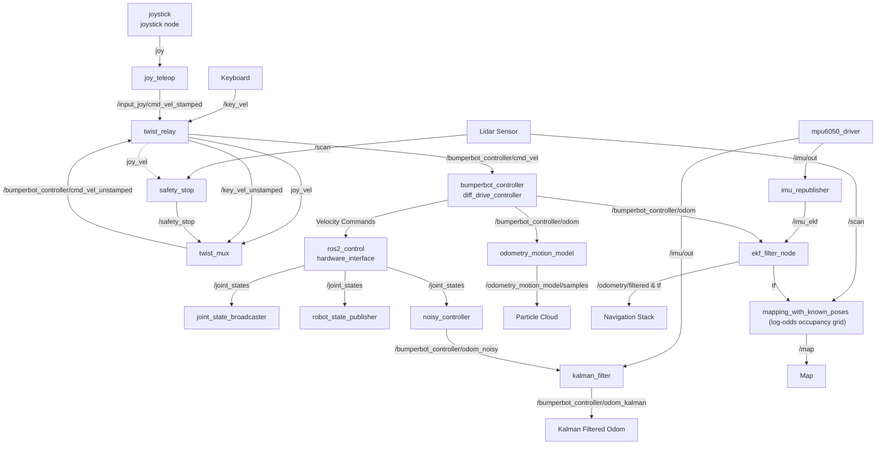

# Bumperbot Architecture

This document provides a detailed overview of the Bumperbot project's ROS 2 architecture, including nodes, topics, actions, and services across various subsystems.

## 1. High-Level Architecture Graph

Below is the high-level data flow diagram showing the core nodes and topics.

```mermaid
graph TD
    %% Input Devices
    Joy[joystick <br/> joystick node] -->|joy| JoyTeleop[joy_teleop]
    Keyboard[Keyboard] -->|/key_vel| TwistRelay[twist_relay]

    %% Teleoperation Flow
    JoyTeleop -->|/input_joy/cmd_vel_stamped| TwistRelay
    TwistRelay -->|joy_vel| TwistMux[twist_mux]
    TwistRelay -->|/key_vel_unstamped| TwistMux
    
    %% Safety & Multiplexing
    Lidar[Lidar Sensor] -->|/scan| SafetyStop[safety_stop]
    TwistRelay -.->|joy_vel| SafetyStop
    SafetyStop -->|/safety_stop| TwistMux
    
    %% Control Flow
    TwistMux -->|/bumperbot_controller/cmd_vel_unstamped| TwistRelay
    TwistRelay -->|/bumperbot_controller/cmd_vel| BumperbotCtrl[bumperbot_controller <br/> diff_drive_controller]
    
    %% Hardware Interface
    BumperbotCtrl -->|Velocity Commands| Hardware[ros2_control <br/> hardware_interface]
    Hardware -->|/joint_states| JointStateBroadcaster[joint_state_broadcaster]
    Hardware -->|/joint_states| RSP[robot_state_publisher]
    Hardware -->|/joint_states| NoisyCtrl[noisy_controller]
    
    %% Sensors & Localization
    MPU[mpu6050_driver] -->|/imu/out| IMURepub[imu_republisher]
    MPU -->|/imu/out| KF[kalman_filter]
    IMURepub -->|/imu_ekf| EKF[ekf_filter_node]
    BumperbotCtrl -->|/bumperbot_controller/odom| EKF
    BumperbotCtrl -->|/bumperbot_controller/odom| OdoMM[odometry_motion_model]
    NoisyCtrl -->|/bumperbot_controller/odom_noisy| KF
    KF -->|/bumperbot_controller/odom_kalman| KFOut[Kalman Filtered Odom]
    OdoMM -->|/odometry_motion_model/samples| Particles[Particle Cloud]
    EKF -->|/odometry/filtered & tf| Nav[Navigation Stack]
    
    %% Mapping
    Lidar -->|/scan| Mapper["mapping_with_known_poses <br/> (log-odds occupancy grid)"]
    EKF -->|tf| Mapper
    Mapper -->|/map| MapOutput[Map]
```

---

## 2. Teleoperation and Control Stack

This subsystem processes user inputs from a joystick or keyboard, applies safety constraints, and passes commands down to the motor controllers.

### `joy_node` (package: joy)
- **Description**: Reads inputs from the physical game controller.
- **Published Topics**: 
  - `/joy` (`sensor_msgs/Joy`): Raw axes and buttons data.

### `joy_teleop` (package: joy_teleop)
- **Description**: Maps raw joystick buttons/axes to velocity commands (requires deadman button 5 to be held).
- **Subscribed Topics**: `/joy` (`sensor_msgs/Joy`)
- **Published Topics**:
  - `/input_joy/cmd_vel_stamped` (`geometry_msgs/TwistStamped`)

### `twist_relay` (package: bumperbot_controller)
- **Description**: A utility node that relays and converts `TwistStamped` messages to `Twist` messages (and vice versa) so that they are compatible with `twist_mux`.
- **Subscribed Topics**: 
  - `/input_joy/cmd_vel_stamped` (`geometry_msgs/TwistStamped`)
  - `/key_vel` (`geometry_msgs/TwistStamped`)
  - `/bumperbot_controller/cmd_vel_unstamped` (`geometry_msgs/Twist`)
- **Published Topics**:
  - `joy_vel` (`geometry_msgs/Twist`): Sent to `twist_mux`.
  - `/key_vel_unstamped` (`geometry_msgs/Twist`): Sent to `twist_mux`.
  - `/bumperbot_controller/cmd_vel` (`geometry_msgs/TwistStamped`): Sent to the actual robot controller.

### `twist_mux` (package: twist_mux)
- **Description**: Multiplexes different velocity commands based on priority (joystick has priority 99, keyboard has priority 90). It also listens to locks to completely stop the robot if a safety condition is triggered.
- **Subscribed Topics**:
  - `joy_vel` (`geometry_msgs/Twist`)
  - `/key_vel_unstamped` (`geometry_msgs/Twist`)
  - `/safety_stop` (`std_msgs/Bool`): Priority 255 lock.
- **Published Topics**:
  - `/bumperbot_controller/cmd_vel_unstamped` (`geometry_msgs/Twist`)

### `safety_stop` (package: bumperbot_utils)
- **Description**: Analyzes laser scan data and joystick velocity to determine if the robot is about to collide with an obstacle. Creates warning zones and danger zones.
- **Subscribed Topics**:
  - `/scan` (`sensor_msgs/LaserScan`)
  - `joy_vel` (`geometry_msgs/Twist`)
- **Published Topics**:
  - `/safety_stop` (`std_msgs/Bool`): Activates the lock in `twist_mux` if in danger zone.
  - `/satefy_zones` (`visualization_msgs/MarkerArray`): Displays the hazard zones in RViz.
- **Action Clients**:
  - `joy_turbo_decrease` / `joy_turbo_increase` (`twist_mux_msgs/JoyTurbo`): Adjusts speed limits dynamically.

### `ros2_control_node` / `bumperbot_controller` (package: controller_manager)
- **Description**: The core hardware interface and differential drive controller manager. Uses the `diff_drive_controller` plugin.
- **Subscribed Topics**: 
  - `/bumperbot_controller/cmd_vel` (`geometry_msgs/TwistStamped`)
- **Published Topics**:
  - `/bumperbot_controller/odom` (`nav_msgs/Odometry`): Wheel odometry.
  - `/joint_states` (`sensor_msgs/JointState`): Wheel joint positions.
  - `/tf` (`tf2_msgs/TFMessage`): Transform from `odom` -> `base_footprint`.

---

## 3. Sensors and Hardware Interface

### `mpu6050_driver` (package: bumperbot_firmware)
- **Description**: Custom Python driver to read raw accelerometer and gyroscope data from the MPU6050 over I2C.
- **Published Topics**:
  - `/imu/out` (`sensor_msgs/Imu`): Raw IMU data.

### `robot_state_publisher` (package: robot_state_publisher)
- **Description**: Broadcasts the static transformations of the robot using its URDF.
- **Subscribed Topics**: `/joint_states` (`sensor_msgs/JointState`)
- **Published Topics**: `/tf`, `/tf_static`, `/robot_description`

---

## 4. Localization and Mapping

### `imu_republisher` (package: bumperbot_localization)
- **Description**: Re-publishes IMU data with a modified `frame_id` (`base_footprint_ekf`) specifically formatted for the EKF node.
- **Subscribed Topics**: `/imu/out` (`sensor_msgs/Imu`)
- **Published Topics**: `/imu_ekf` (`sensor_msgs/Imu`)

### `ekf_filter_node` (package: robot_localization)
- **Description**: Extended Kalman Filter that fuses wheel odometry and IMU data to produce a highly accurate pose estimation.
- **Subscribed Topics**:
  - `/bumperbot_controller/odom` (`nav_msgs/Odometry`)
  - `/imu_ekf` (`sensor_msgs/Imu`)
- **Published Topics**:
  - `/odometry/filtered` (`nav_msgs/Odometry`)
  - `/tf`: Smoothed transform from `odom` to `base_footprint`.

### `mapping_with_known_poses` (package: bumperbot_mapping)
- **Description**: Builds a probabilistic occupancy grid map using known robot poses (from TF) and laser scans. Implements an **inverse sensor model** with **Bresenham ray-casting** and uses **log-odds notation** for numerically stable probability accumulation. Free cells are assigned `P=0.35`, occupied cells `P=0.9`, and the prior is `P=0.5`. The map is periodically converted from log-odds back to probability and published.
- **Parameters**:
  - `width` (float, default: 50.0): Map width in meters.
  - `height` (float, default: 50.0): Map height in meters.
  - `resolution` (float, default: 0.1): Grid cell size in meters/cell.
- **Subscribed Topics**: `/scan` (`sensor_msgs/LaserScan`)
- **Published Topics**: `/map` (`nav_msgs/OccupancyGrid`) — published on a 1 Hz timer.
- **TF Lookups**: `odom` → `<scan_frame>` (e.g., `base_link_laser`)

### `nav2_map_server` (package: nav2_map_server)
- **Description**: ROS 2 Nav2 map server for loading pre-existing map files. Managed by the `lifecycle_manager`.
- **Services**:
  - `/map_server/load_map` (`nav2_msgs/LoadMap`)
- **Published Topics**: `/map` (`nav_msgs/OccupancyGrid`)

### `odometry_motion_model` (package: bumperbot_localization)
- **Description**: Implements a **probabilistic odometry motion model** for particle-based localization. Maintains a cloud of pose samples that are propagated using odometry increments corrupted by Gaussian noise. The noise is parameterized by four alpha values that model rotational and translational uncertainty. Uses the `angle_diff` utility for proper angular wrapping.
- **Parameters**:
  - `alpha1` (float, default: 0.05): Rotation noise from rotation.
  - `alpha2` (float, default: 0.1): Rotation noise from translation.
  - `alpha3` (float, default: 0.1): Translation noise from translation.
  - `alpha4` (float, default: 0.1): Translation noise from rotation.
  - `num_samples` (int, default: 300): Number of particles.
- **Subscribed Topics**: `/bumperbot_controller/odom` (`nav_msgs/Odometry`)
- **Published Topics**: `/odometry_motion_model/samples` (`geometry_msgs/PoseArray`)

### `kalman_filter` (package: bumperbot_localization)
- **Description**: A custom 1D **Kalman Filter** that fuses noisy wheel odometry angular velocity with IMU gyroscope measurements. Implements the standard predict-update cycle: the state prediction uses the odometry motion increment, and the measurement update fuses the IMU reading using Gaussian fusion.
- **Subscribed Topics**:
  - `/bumperbot_controller/odom_noisy` (`nav_msgs/Odometry`): Noisy wheel odometry.
  - `/imu/out` (`sensor_msgs/Imu`): Raw IMU data (angular velocity z).
- **Published Topics**: `/bumperbot_controller/odom_kalman` (`nav_msgs/Odometry`): Filtered odometry with corrected angular velocity.

---

## 5. Examples & Tests

### `simple_controller` & `noisy_controller` (package: bumperbot_controller)
- **Description**: Custom Python/C++ implementations of a differential drive kinematic model used for educational purposes and testing. The `noisy_controller` adds Gaussian noise (`σ=0.005`) to wheel encoder readings and publishes noisy odometry on `/bumperbot_controller/odom_noisy` with a TF to `base_footprint_noisy`. They can be toggled using launch arguments.
